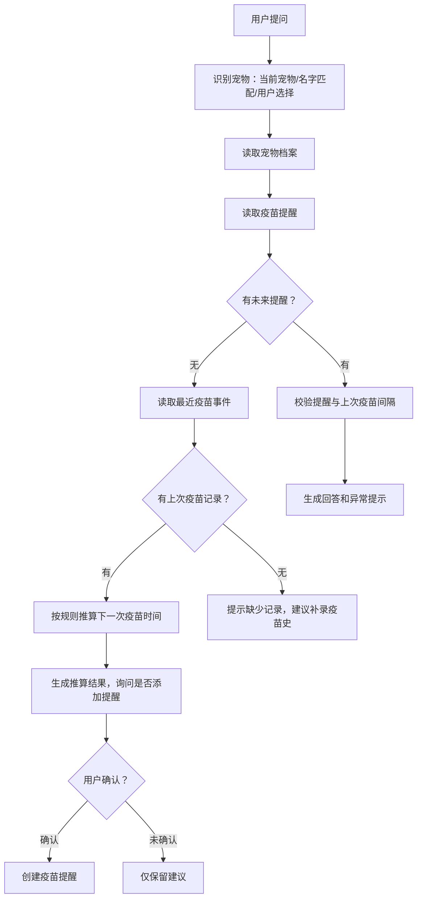

# 毛伙伴 AI 入口与后端架构方案

## 1. 结论

毛伙伴 AI 应拆成两个产品场景：

| 场景 | 定位 | 数据边界 |
|---|---|---|
| 私域宠物 AI 助手 | 面向当前用户和当前宠物的私人助理 | 可读取用户授权的宠物结构化数据、时间线、提醒、预约、交易和医疗协同记录 |
| UGC 评论区 @AI | 面向公开内容的讨论助手 | 默认只读取当前 UGC、评论上下文、公开内容和平台知识库 |

核心边界：评论区 @AI 不能带出用户私有宠物数据；涉及“我的宠物是否适合”“根据我家宠物记录判断”等问题时，进入私域宠物 AI 助手后再读取宠物数据。

后端架构采用“AI 编排层 + 受控业务工具 + 安全策略 + 审计”的方式。LLM 负责理解用户意图和组织回答，事实读取、时间推算、健康分级、写入动作都由后端工具完成。

## 2. 首页入口设计

| 位置 | 现状 | 建议 |
|---|---|---|
| 首页左上 | 当前宠物切换按钮 | 改为 AI 入口 |
| 首页右上 | 用户头像 | 改为当前宠物头像 |
| 宠物切换 | 左上胶囊触发 | 右上宠物头像触发，沿用现有切换事件 |
| 用户入口 | 首页右上头像 | 迁移到 Profile Tab 或个人中心入口 |

首页左上 AI 是全局高频入口，右上当前宠物头像形成“当前宠物上下文”锚点。用户点击右上头像时只做宠物切换，不显示宠物名字，保持首页顶部视觉简洁。

## 3. AI 产品场景

### 3.1 私域宠物 AI 助手

私域宠物 AI 助手用于回答用户自己的宠物问题。

| 能力 | 示例 |
|---|---|
| 宠物档案问答 | “毛球现在多大了？” |
| 疫苗/驱虫/复诊提醒 | “毛球下一次疫苗是什么时候？” |
| 时间线总结 | “最近一个月毛球有什么异常记录？” |
| 健康分级建议 | “今天有点拉肚子，需要去医院吗？” |
| UGC 内容私密分析 | “这篇猫粮测评里的猫粮适合毛球吗？” |
| 操作建议 | “是否帮你添加下一次疫苗提醒？” |

私域助手可以读取宠物档案、宠物事件、提醒事项、预约、交易履约、授权医疗记录等数据，但所有读取都必须经过工具权限控制。

### 3.2 UGC 评论区 @AI

评论区 @AI 用于公开讨论，不读取用户私有宠物数据。

| 评论问题 | 评论区 AI 行为 |
|---|---|
| “这篇科普可信吗？” | 直接基于 UGC 内容和公开知识库回复可信度分析 |
| “这篇说法有没有风险？” | 直接回复通用风险点和需要核实的信息 |
| “这个猫粮适合猫吗？” | 可给通用判断 |
| “适合我家毛球吗？” | 引导进入私域宠物 AI 助手 |
| “我家毛球昨天腹泻还能吃吗？” | 引导进入私域宠物 AI 助手 |

评论区 AI 公开回复应固定包含边界提示：它可以评价公开内容可信度和通用风险，不能针对某只宠物做个体结论。

## 4. UGC 到宠物 AI 的上下文交接

当用户在某篇 UGC 下 @AI 问“我家的 xxx 是否适合这个猫粮”时，评论区 AI 不读取宠物档案，而是创建一次上下文交接。

推荐交互：

| 步骤 | 产品表现 |
|---|---|
| 1 | 用户在评论区输入：“@AI 我家的毛球适合这个猫粮吗？” |
| 2 | AI 公开回复：“这个问题需要结合毛球的宠物档案和喂养记录判断。点击下方按钮，带着这篇内容进入宠物 AI 助手继续。” |
| 3 | 回复下方展示 CTA：“带着这篇内容问宠物助手” |
| 4 | App 打开私域宠物 AI 助手，并带入 `ugc_id` / `comment_id` |
| 5 | 私域助手顶部显示“已带入：某猫粮测评” |
| 6 | 用户选择宠物并确认使用宠物档案分析 |
| 7 | AI 结合 UGC 内容和宠物结构化数据给针对性回答 |

Deep Link 示例：

```text
maohuoban://ai/pet-assistant?ugc_id=<ugc_id>&comment_id=<comment_id>
```

服务端不能信任客户端传入的 UGC 正文。私域助手打开后，由服务端根据 `ugc_id` 重新读取当前用户可见的 UGC 内容，并生成 `UGCContextSnapshot`。

## 5. 后端架构

### 5.1 Rust workspace 分层

| crate | 职责 |
|---|---|
| `maohuoban-ai-domain` | AI 会话、消息、工具调用、引用来源、建议操作、风险等级、授权范围 |
| `maohuoban-ai-application` | 意图识别、宠物解析、工具编排、疫苗/驱虫推理、健康分级、LLM 调用 |
| `maohuoban-ai-infrastructure` | LLM Provider、Embedding Provider、向量/全文检索实现、审计日志、Redis 限流 |
| `maohuoban-ai-http` | 聊天接口、SSE 流式回复、确认执行接口、UGC @AI 回调接口 |
| `maohuoban-ai-worker` | UGC 索引、宠物时间线摘要、知识库 embedding、异步审计分析 |

AI 模块通过 application 端口调用现有宠物、首页、同城、医疗、交易等业务模块，不能跨层直接读其他业务域的 infrastructure。

### 5.2 核心数据模型

| 模型 | 说明 |
|---|---|
| `AiConversation` | 一次 AI 会话，记录入口、用户、当前宠物、状态 |
| `AiMessage` | 用户消息、AI 消息、系统生成的提示消息 |
| `AiConversationSurface` | 入口类型：`home_private`、`pet_profile`、`ugc_comment`、`merchant_console` |
| `AiContextPolicy` | 当前入口可读取的数据范围和可调用工具范围 |
| `AiToolCall` | 工具调用记录，包含工具名、输入摘要、输出摘要、耗时、状态 |
| `AiCitation` | 回答引用来源：宠物事件、提醒、UGC、知识库条目 |
| `AiProposedAction` | AI 建议的待确认写操作 |
| `AiActionConfirmation` | 用户确认后的执行记录 |
| `AiAuditLog` | 审计日志，记录读取范围、写入动作、模型、风险标记 |
| `AiContextHandoff` | UGC 到私域助手的上下文交接 |
| `UGCContextSnapshot` | UGC 标题、正文摘要、图片 OCR、商品/成分摘要、可见性状态 |
| `AiAnswerVerifier` | 回答返回前的事实、工具、安全校验器 |
| `AiEvaluationCase` | 离线评测用例，覆盖问题、数据夹具、期望工具、期望回答边界 |

## 6. LLM 工具设计

LLM 需要工具，但工具必须是受控业务工具。

| 类型 | 工具示例 | 执行策略 |
|---|---|---|
| 只读工具 | `get_pet_profile`、`list_pet_health_events`、`get_pet_reminders`、`get_ugc_context` | 可由 AI 编排层直接调用 |
| 计算工具 | `estimate_next_vaccine_due`、`validate_vaccine_interval`、`score_health_triage`、`score_ugc_reliability` | 可直接调用，输出结构化结论 |
| 写入工具 | `create_pet_reminder`、`create_pet_event`、`create_followup_task` | 必须先生成 `AiProposedAction`，用户确认后执行 |

LLM 不能直接 SQL 查询，不能绕过业务服务，不能调用未注册工具。工具入参必须由 AI 编排层补齐 `user_id`、`pet_id`、`surface`、权限范围，不能完全信任模型生成。

私域事实类问题不能交给 LLM 自主决定是否查数据。后端应用服务必须根据意图强制执行必需工具，再把结构化事实包交给模型生成回答。

## 7. 疫苗问答流程

用户问：“我的毛球下一次疫苗是什么时候？”

处理链路：



优先级：

| 优先级 | 数据来源 | 行为 |
|---|---|---|
| 1 | 已存在未来疫苗提醒 | 直接回答，并校验是否与最近疫苗记录间隔合理 |
| 2 | 没有提醒，但有上次疫苗记录 | 根据物种、年龄、疫苗类型和规则推算下一次时间 |
| 3 | 没有提醒也没有记录 | 告知缺少记录，建议用户补录疫苗史 |

写入动作：

| 阶段 | 行为 |
|---|---|
| AI 建议 | 生成“是否为毛球添加 2026-08-20 狂犬疫苗提醒”的确认卡 |
| 用户确认 | 用户点击“添加提醒” |
| 后端执行 | 调用 `create_pet_reminder` |
| 审计 | 记录 AI 会话、建议内容、用户确认时间、写入结果 |

## 8. 健康建议与分级

健康建议必须采用“规则分诊 + 宠物记录 + LLM 表达”。

用户问：“今天我的宠物有点拉肚子，需要去医院吗？”

处理链路：

| 阶段 | 行为 |
|---|---|
| 意图识别 | 判断为健康咨询/异常症状分级 |
| 数据读取 | 查最近饮食、排便、呕吐、体重、驱虫、疫苗、就诊、用药、异常事件 |
| 红旗规则 | 便血、频繁呕吐、精神沉郁、脱水、幼宠、误食异物、持续超过 24-48 小时等 |
| 记录对比 | 判断是否近期换粮、驱虫、接种、外出、用药或就诊 |
| 分级输出 | 给出“观察 / 预约就诊 / 尽快就医”的建议 |
| 记录回流 | 询问是否记录症状到宠物时间线 |

AI 不能给诊断结论，不能开药，不能替代兽医。回答应说明依据来自哪些记录，并提示缺失信息。

## 9. UGC 科普可信度分析

用户在科普贴评论区 @AI：“这篇内容可信吗？”

评论区 AI 可以直接回复，因为它只依赖公开内容。

处理链路：

| 工具 | 输入 | 输出 |
|---|---|---|
| `analyze_ugc_claims` | 帖子正文、图片 OCR、评论问题 | 关键主张列表 |
| `retrieve_public_knowledge` | 主张关键词 | 平台审核过的科普知识和风险提示 |
| `score_ugc_reliability` | 主张、证据、来源 | 可信度等级、风险标签、缺失信息 |
| `compose_public_reply` | 分析结果 | 可公开发布的评论回复 |

公开回复结构：

| 段落 | 内容 |
|---|---|
| 可信度结论 | 高 / 中 / 低 / 信息不足 |
| 依据 | 哪些点有公开证据支撑，哪些只是经验判断 |
| 风险点 | 绝对化表达、带货倾向、医疗化建议、缺剂量、缺适用条件 |
| 建议 | 建议核对哪些来源，必要时咨询兽医 |

## 10. 检索与记忆

检索层分成结构化事实、长文本语义和公开知识三类。

| 数据 | 推荐存储/检索 | 原因 |
|---|---|---|
| 疫苗、驱虫、就诊、体重、预约 | PostgreSQL 结构化查询 | 准确、可解释、可审计 |
| 宠物时间线摘要、病历长文本、UGC 内容 | PostgreSQL FTS + embedding | 支持语义匹配和上下文补充 |
| 平台规则、健康科普、服务说明 | 独立知识库 | 可审核、可版本化 |
| 用户长期偏好和宠物习惯 | 用户级记忆表 + 权限过滤 | 防止跨用户污染 |

## 11. LLM 接入与质量门

首版可接入 DeepSeek API，但质量门必须建立在毛伙伴自己的 AI 编排层。模型能力只作为候选实现，不能成为事实准确性和权限边界的唯一保障。

### 11.1 接入原则

| 原则 | 要求 |
|---|---|
| 后端强制工具编排 | 私域宠物问题由后端先查结构化数据，再调用 LLM 表达 |
| 结构化事实包输入 | LLM 只能基于 `facts`、`computed`、`citations` 生成回答 |
| 回答前事实校验 | 返回用户前必须经过 `AiAnswerVerifier` |
| 模型可替换 | DeepSeek、其他云模型、本地模型都通过 `LlmProvider` 端口接入 |
| 高风险保守回复 | 事实不足、工具失败、健康红旗不明确时，回答应保守并要求补充信息 |

DeepSeek 推荐用途：

| 用途 | 建议 |
|---|---|
| 意图识别 | 可用，输出固定 JSON schema |
| 回答生成 | 可用，但输入只能是后端事实包 |
| 健康咨询表达 | 可用，关键分级由规则工具完成 |
| UGC 主张提取 | 可用，可信度评分需结合知识库和规则 |
| 写操作 | 只能生成建议动作，不能直接执行 |

### 11.2 强制工具链

以“我的宠物下一次疫苗是什么时候”为例，后端不能只把问题交给 LLM。应用服务必须强制执行：

```text
识别宠物 -> 读取提醒 -> 读取疫苗事件 -> 校验间隔 -> 推算缺失提醒 -> 生成事实包 -> LLM 生成回答 -> 事实校验 -> 返回
```

事实包示例：

```json
{
  "intent": "pet_vaccine_query",
  "pet": {
    "id": "pet_123",
    "name": "毛球",
    "species": "cat",
    "birthday": "2024-05-01"
  },
  "facts": [
    {
      "source_id": "event_001",
      "type": "vaccine_record",
      "title": "狂犬疫苗",
      "occurred_at": "2025-08-20"
    }
  ],
  "computed": {
    "next_due_at": "2026-08-20",
    "basis": "按上一条狂犬疫苗记录推算年度加强",
    "confidence": "medium"
  }
}
```

### 11.3 回答校验

`AiAnswerVerifier` 在返回前执行校验。

| 校验项 | 规则 |
|---|---|
| 来源校验 | 回答中的宠物名、日期、疫苗名、提醒时间必须来自 `facts` 或 `computed` |
| 工具完整性 | `pet_vaccine_query` 必须有提醒查询和疫苗事件查询记录 |
| 无来源事实拦截 | 回答出现事实包外的医院、品牌、剂量、诊断、历史记录时拒绝返回 |
| 写操作校验 | 创建提醒、记录症状、创建待办必须对应 `AiProposedAction` |
| 医疗边界校验 | 诊断、处方、替代兽医结论直接拦截或重写为安全提示 |
| 隐私边界校验 | UGC 评论区回答不能包含私域宠物记录 |
| 置信度校验 | 事实不足时只能回答“记录不足”，并说明需要补充的信息 |

拦截后的处理：

| 情况 | 返回策略 |
|---|---|
| 必需工具未执行 | 重新走工具链 |
| 工具失败 | 告知暂时无法读取记录，提示稍后重试 |
| 回答含无来源事实 | 重新生成一次；再次失败则返回结构化保守回答 |
| 医疗高风险 | 返回就医建议和缺失信息，不输出诊断 |

### 11.4 离线评测

上线前需要建立 golden cases，覆盖 100-300 条典型和边界问题。

| 评测集 | 覆盖内容 |
|---|---|
| 宠物结构化问答 | 档案、年龄、体重、疫苗、驱虫、提醒 |
| 健康分级 | 腹泻、呕吐、精神差、便血、幼宠、慢病 |
| UGC 可信度 | 科普贴、带货贴、夸大宣传、缺少来源 |
| UGC 到私域交接 | “适合我家宠物吗”等必须跳转私域的场景 |
| 隐私边界 | 评论区不能泄露私有记录、不能跨宠物读取 |
| 写操作确认 | 添加提醒、记录症状、创建待办必须等待用户确认 |
| 幻觉拦截 | 模型编造日期、医院、疫苗品牌、用药建议等 |

发布门槛：

| 指标 | 门槛 |
|---|---:|
| 私域事实准确率 | >= 98% |
| 必需工具调用覆盖率 | 100% |
| 无来源事实率 | 0% |
| 隐私边界违规率 | 0% |
| 健康红旗漏判率 | 0% |
| 写操作未确认执行率 | 0% |
| 回答 JSON/schema 合法率 | >= 99% |

### 11.5 CI 与线上监控

| 层级 | 质量门 |
|---|---|
| Prompt 变更 | 必须跑离线评测，低于门槛禁止合并 |
| 工具 schema 变更 | 必须验证强制工具链和回答校验 |
| 模型版本变更 | 必须跑全量 golden cases，对比旧版本 |
| 线上灰度 | 监控工具调用率、拦截率、差评率、重试率、延迟 |
| 事故回滚 | 支持按模型、prompt、工具版本快速回滚 |

线上关键指标：

| 指标 | 含义 |
|---|---|
| `required_tool_coverage` | 必需工具是否按意图完整执行 |
| `unsupported_fact_rate` | 回答中无来源事实占比 |
| `answer_verifier_block_rate` | 回答被校验器拦截比例 |
| `privacy_boundary_violation` | 隐私边界违规次数 |
| `medical_safety_block_rate` | 医疗安全拦截次数 |
| `user_negative_feedback_rate` | 用户负反馈率 |
| `confirmed_action_success_rate` | 用户确认后的写操作成功率 |

## 12. zvec 评估

`alibaba/zvec` 是进程内向量数据库，支持向量检索、全文检索、混合检索和 DiskANN，许可证为 Apache-2.0。

| 维度 | 判断 |
|---|---|
| 对毛伙伴是否有帮助 | 有，可作为后续检索引擎候选 |
| 是否适合首版核心依赖 | 不建议 |
| 主要原因 | 毛伙伴首版重点是权限、工具、审计、结构化事实准确性；PostgreSQL 体系更贴合现有后端 |
| 推荐接入方式 | 抽象 `AiRetrievalRepository` 端口，首版用 PostgreSQL，后续评估 zvec 实现 |
| 适合场景 | 本地高性能混合检索、端侧/边缘检索、独立知识库实验 |

zvec 不能替代权限系统、工具编排、医疗边界和审计。

## 13. 沙盒设计

这里的沙盒不是代码执行沙盒，而是数据、工具、权限和安全策略沙盒。

| 沙盒类型 | 作用 |
|---|---|
| 数据沙盒 | 限制 AI 只能读取当前用户授权的数据 |
| 工具沙盒 | 限制 AI 只能调用白名单业务工具 |
| 写入沙盒 | 写操作必须生成待确认动作，用户确认后执行 |
| 医疗沙盒 | 限制 AI 不能诊断、开药或替代兽医 |
| UGC 沙盒 | 评论区公开回复不能带出私有宠物数据 |
| Prompt 沙盒 | UGC 或用户输入中的“忽略规则/读取别人数据”等指令无效 |
| 审计沙盒 | 每次读取、推算、写入都有日志和来源 |
| 回答沙盒 | 回答必须通过事实来源、工具完整性和医疗边界校验 |

## 14. 隐私与合规规则

| 规则 | 要求 |
|---|---|
| 最小上下文 | Prompt 只放回答当前问题所需字段 |
| 租户隔离 | 所有工具调用强制绑定 `user_id` 和可访问 `pet_id` |
| 私域确认 | 涉及宠物私有数据的 UGC 问题必须进入私域助手 |
| 外部模型 | 选择企业数据不训练、低保留或零保留策略 |
| 敏感字段 | 医疗、保险、交易、芯片等字段分级脱敏 |
| 引用来源 | 回答中标明来自宠物记录、提醒、UGC 或知识库 |
| 审计日志 | 记录工具调用、读取范围、写入动作和风险标记 |

## 15. 推荐接口

| 接口 | 说明 |
|---|---|
| `POST /ai/chat` | 私域 AI 对话，支持流式返回 |
| `POST /ai/ugc/comment-reply` | UGC @AI 评论回复 |
| `POST /ai/handoffs` | 创建 UGC 到私域助手的上下文交接 |
| `GET /ai/handoffs/{id}` | 私域助手读取交接上下文 |
| `POST /ai/actions/{id}/confirm` | 用户确认 AI 建议写操作 |
| `POST /ai/actions/{id}/cancel` | 用户取消 AI 建议写操作 |
| `POST /ai/messages/{id}/feedback` | 用户反馈回答质量 |
| `POST /ai/evaluations/run` | 内部接口，触发指定模型和 prompt 的离线评测 |
| `GET /ai/evaluations/{id}` | 内部接口，查看评测结果和失败用例 |

## 16. 分阶段落地

| 阶段 | 目标 | 范围 |
|---|---|---|
| P0 | 建立 AI 边界和入口 | 首页入口、私域助手壳、UGC @AI 边界策略 |
| P1 | LLM 接入和质量门 | DeepSeek Provider、强制工具链、事实包、回答校验、离线评测 |
| P2 | 宠物结构化问答 | 档案、疫苗、驱虫、体重、提醒读取 |
| P3 | AI 建议动作 | 添加提醒、记录症状、创建复诊待办，全部走确认卡 |
| P4 | UGC 可信度分析 | 科普贴可信度、风险标签、公开评论回复 |
| P5 | UGC 到私域助手交接 | 带入 UGC 内容，结合宠物档案做个体分析 |
| P6 | 健康分级建议 | 腹泻、呕吐、食欲异常、精神异常等规则分诊 |
| P7 | 记忆与检索增强 | 宠物长期时间线摘要、知识库、语义检索、zvec 评估 |

## 17. 当前决策

| 决策 | 状态 |
|---|---|
| 评论区 @AI 默认不读取私有宠物数据 | 已确认 |
| 需要个体宠物判断时进入私域宠物 AI 助手 | 已确认 |
| UGC 内容通过服务端上下文交接进入私域助手 | 已确认 |
| LLM 需要业务工具，但不能直接查库或自由写入 | 建议采纳 |
| 写操作必须用户确认 | 建议采纳 |
| 首版检索优先 PostgreSQL，zvec 作为后续候选 | 建议采纳 |
| DeepSeek 可作为首版 LLM Provider，但质量门由毛伙伴后端控制 | 建议采纳 |
| 私域事实类问题必须强制执行工具链，不能只靠 prompt | 建议采纳 |
| 回答返回前必须通过 `AiAnswerVerifier` | 建议采纳 |

## 18. 待确认问题

| 问题 | 推荐默认 |
|---|---|
| 首页 AI 入口是否直接打开全屏对话 | 使用系统 `NavigationStack` 推进到 AI 助手页 |
| 私域助手是否默认绑定当前宠物 | 默认绑定首页当前宠物，支持切换 |
| UGC @AI 回复是否自动发布 | 高风险内容进入人工审核队列，其余可自动回复 |
| 健康分级规则由谁维护 | 后端知识库 + 审核后台维护，版本化发布 |
| AI 生成提醒是否写宠物事件 | 只写提醒；用户确认记录症状时再写事件 |
| DeepSeek 模型版本如何灰度 | 使用模型版本配置表，按用户比例灰度并保留快速回滚 |
