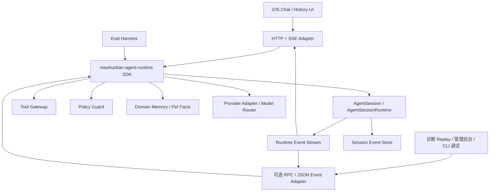

# 毛球 Agent Runtime 架构讨论记录

- 更新时间：2026-06-28
- 文档类型：讨论记录
- 当前状态：探索阶段，尚未定目标，尚未进入实施方案
- 讨论主题：毛球如何从“带规则闸门的聊天接口”演进为真正的宠物照护 Agent
- 参考材料：
  - `/Users/fengjinyi/package`：`@anthropic-ai/claude-code` 打包产物，用于观察代码类 Agent 的运行时架构
  - `references/agent/rig`：`0xPlaygrounds/rig` 本地克隆，Agent loop / Tool / HITL 重点参考
  - `references/agent/adk-rust`：`zavora-ai/adk-rust` 本地克隆，完整平台组件与 Guardrail / Session / Event 重点参考
  - `references/agent/anda`：`ldclabs/anda` 本地克隆，工具发现 / 模型路由 / 上下文压缩 / Memory 重点参考
  - `references/agent/pi`：`earendil-works/pi` 本地克隆，SDK / RPC / JSON event stream / TUI 分层重点参考
  - [Pi 官方文档](https://pi.dev/docs/latest)：SDK 化运行时与多种消费端分层参考
  - `docs/engineering/agent-memory-security/00_毛球Agent记忆隔离与工具安全目标文档.md`
  - `docs/product/strategy/04_宠物事实采集与毛球Agent记忆系统设计.md`

---

## 1. 当前讨论结论

| 项 | 讨论结论 |
|---|---|
| 当前阶段 | 还在找方向，不应把现有讨论写成目标文档或实施计划 |
| 参考项目价值 | `/Users/fengjinyi/package` 能解释“Agent 为什么聪明”，但它是代码方向 Agent，不能直接等同于毛球的宠物照护场景 |
| 当前毛球问题 | 后端更像“规则 gate + 事实包 + 一次 Provider 调用”的聊天链路，还不是完整 Agent Runtime |
| 智能来源 | 毛球的智能不能只依赖 LLM provider，必须来自运行时架构、工具、记忆、事实底座、策略、恢复和评测 |
| Provider 关系 | LLM provider 会影响表达、推理和工具选择质量，但不应决定毛球是否整体瘫痪 |
| 手写语义边界 | 只靠代码关键词判断用户意图会越来越硬，无法覆盖真实用户语义 |
| 软引导边界 | “你可以问我宠物相关问题”这类固定话术不够聪明；引导应基于用户当前意图、宠物上下文、可用工具和失败原因生成 |

## 2. 参考项目观察

`/Users/fengjinyi/package` 是 Claude Code 的 npm 打包产物，不是完整源码仓库。它的 `cli.js.map` 暴露了大量源码映射，足够观察 Agent Runtime 的关键设计。

| 机制 | 观察到的设计 | 对毛球的启发 |
|---|---|---|
| 工具定义 | 工具有 `inputSchema`、权限检查、只读/破坏性/并发安全等元信息 | 毛球工具也应声明输入 schema、权限、风险等级、是否可并发、是否会写入 |
| 工具调度 | 只读安全工具可以并发，非只读工具串行执行 | 宠物事实读取可并发，写入确认、提醒创建、事实回写必须串行并受确认约束 |
| 工具执行边界 | 工具调用前有权限、hook、错误分类、观测 | 毛球所有私有数据读取必须经过 Agent Gateway 和审计 |
| 子 Agent | 支持不同 agent definition、工具池、模型、权限模式、记忆范围 | 毛球后续可拆为照护问答、记录整理、异常追踪、食品分析、App 帮助等专用能力 |
| 主循环 | 主 Agent 循环负责模型采样、工具执行、工具结果回灌、上下文压缩、恢复 | 毛球当前缺少这一层，尤其缺“模型申请工具 -> 工具执行 -> 结果回灌 -> 再生成” |
| Provider 抽象 | 模型、provider、fallback、retry 独立于业务逻辑 | 毛球应把 provider 错误归类为系统失败，不把上游原文直接给用户 |
| 记忆与压缩 | 会话可压缩、可抽取长期记忆、可恢复未完成对话 | 毛球需要短期聊天摘要、宠物事实记忆、用户偏好、家庭/宠物 scope 隔离 |
| 权限裁决 | LLM/classifier 可辅助判断，但最终权限由代码系统裁决 | 毛球可用 LLM 判断语义，但宠物访问、写入、医疗边界必须由后端策略裁决 |
| 会话恢复 | 过滤未完成 tool use、恢复上下文、避免坏状态继续传播 | 毛球需要处理流式中断、Provider 失败、工具失败、前端重连、历史恢复 |

## 3. 当前毛球实现现状

| 层 | 当前已有 | 当前缺口 |
|---|---|---|
| LLM 请求模型 | `LlmChatRequest` 已有 `messages`、`tools`、`tool_choice` 字段，Runtime 主链路已通过 Workbench 注入可见工具目录 | 后续还需要补齐 provider fallback、模型能力差异和更细粒度工具选择策略 |
| Provider | 已有 `LlmProvider`、OpenAI 兼容 Provider、Disabled Provider | 还缺 provider fallback、分级错误策略、provider 能力差异抽象 |
| SSE Pipeline | 已能把 Runtime 模型流、工具进度、完成和错误转换为毛伙伴稳定事件 | 还需要完善重连、恢复和更细的前端观测字段 |
| 工具系统 | 已有 `ToolRegistry`、`AiToolDefinition`、`AiToolContext`、`AiToolResult`，并已进入 Agent Runtime 主链路 | 后续需要扩展更多业务工具和确认态写入闭环 |
| 意图闸门 | 已有规则版 `AiIntentGate` | 关键词规则过硬，寒暄、模糊表达、隐含宠物语义容易被挡掉 |
| 事实包 | 已有 `AiFactPackage`、身份/饮食/弱线索加载器 | 事实包仍偏“提前装配”，还不是按模型计划动态调用 |
| 回答校验 | 已有 `AiAnswerVerifier` | 校验仍是末端阻断，缺少失败后的恢复规划 |
| 历史记录 | 已接入会话和消息持久化 | 系统错误、gate 拒答、正常回答、工具失败的持久化策略还需要更清晰分类 |
| 观测 | 已有诊断 SDK 和 AI 链路观测点 | 还需要按 Agent loop 增加 turn、tool、policy、provider、recovery 维度 |

## 4. 当前架构问题

| 问题 | 表现 | 本质 |
|---|---|---|
| gate 过硬 | 用户发“你好”会直接得到“我现在只能处理宠物照护...” | 代码规则把语义分类当最终答案生成 |
| 工具主循环需要继续扩展 | 工具 schema 已进入 Runtime 模型请求，当前工具集合仍偏少 | 后端需要继续扩展按需读取、确认写入和恢复策略 |
| Provider 错误和业务回复边界不够清晰 | 未配置 provider、上游错误、越界拒答、模型正常回答容易混在一条聊天语义里 | 缺少统一错误分类与持久化策略 |
| 软引导不聪明 | 越界或模糊请求只能返回固定文案 | 缺少基于当前状态的 Recovery Planner |
| 事实读取偏预加载 | 进入 Provider 前固定加载身份、饮食、线索等上下文 | 用户问题复杂后需要按需工具调用，避免 token 浪费和事实噪音 |
| Agent 下限依赖模型 | 换弱模型后可能不会正确使用边界、工具或追问 | 运行时需要把关键安全、流程和恢复逻辑固化在代码层 |

## 5. 需要继续讨论的问题

| 问题 | 需要找的答案 |
|---|---|
| 毛球是不是单 Agent | 是否需要一个主 Orchestrator 加多个专用子能力，还是一个统一 Agent 配工具池 |
| gate 应该怎么做 | 入口是纯规则、轻量模型分类、规则 + LLM 混合，还是由 Agent Runtime 先做低成本理解 |
| 寒暄怎么处理 | “你好”“在吗”“毛球呢”这类消息是轻量陪伴、拉回宠物、还是进入主 Agent |
| 软引导怎么做 | 如何根据用户当前宠物、已有记录、缺失信息和可用工具给出下一步引导 |
| 工具调用粒度 | 工具应该是粗粒度事实包工具，还是细粒度事件/疫苗/饮食/异常工具 |
| 记忆怎么分层 | 短期对话、长期用户偏好、宠物事实、家庭共享记忆、App 使用偏好分别如何建模 |
| 错误是否入历史 | provider 未配置、超时、限流、上游失败、工具失败、policy 拒绝分别怎么持久化 |
| 模型能力差异怎么兜底 | 弱模型能否通过强 schema、工具选择约束、校验和恢复策略保持可用下限 |
| 评测怎么定义聪明 | 需要哪些宠物照护、记录查询、模糊表达、越权、防注入、provider 失败样例 |

## 6. 候选架构方向

这部分只是讨论候选方向，不代表已经定案。

| 层 | 候选职责 |
|---|---|
| Conversation Orchestrator | 管理一次用户输入的生命周期，包括请求、SSE、状态、持久化和最终分类 |
| Agent Runtime | 承载多轮 turn loop：模型输出、工具调用、工具执行、结果回灌、继续生成 |
| Planner / Router | 判断用户意图、需要哪些工具、是否需要追问、是否只走轻量回复 |
| Tool Registry | 注册宠物身份、疫苗、饮食、异常、提醒、App 帮助等工具 |
| Tool Runtime | 统一执行工具、注入 actor、鉴权、裁剪返回、记录审计 |
| Policy Guard | 做权限、隐私、医疗、写入确认、成本和越权边界的最终裁决 |
| Context Builder | 拼装当前 turn 需要的最小上下文，避免一次性塞入所有事实 |
| Memory Layer | 管理会话摘要、用户偏好、宠物事实记忆、家庭共享记忆和检索隔离 |
| Provider Adapter | 处理不同模型协议、能力、错误、重试、fallback 和脱敏观测 |
| Response Composer | 把工具结果、策略结果和模型输出组织成用户可理解的回答 |
| Recovery Planner | 对模糊、越界、缺事实、工具失败、provider 失败给出可执行恢复路径 |
| Eval / Telemetry | 用评测集和观测数据持续判断毛球是否变聪明、是否越界、是否退化 |

## 7. 软引导讨论

当前“你可以问我宠物相关问题”太粗糙。更合理的软引导应该像 Agent 一样理解用户当前处境。

| 场景 | 粗糙做法 | 更像 Agent 的做法 |
|---|---|---|
| 寒暄 | 固定拒答 | 简短回应，并结合当前宠物或最近记录给出可问方向 |
| 模糊问题 | 要求用户重新描述 | 结合当前选中宠物、最近异常、疫苗/饮食缺口主动给候选问题 |
| 缺宠物上下文 | 固定要求选择宠物 | 列出当前授权宠物并说明选择后能查什么 |
| 缺事实 | “没有记录” | 说明缺哪类事实，并提供一键补记录或确认动作 |
| 越界请求 | 固定拒绝 | 说明边界，并把用户目标转换成允许范围内的替代动作 |
| provider 失败 | “稍后重试” | 明确这是服务暂不可用，保留用户输入状态，允许重试，不写成正常助手回答 |

## 8. 与代码类 Agent 的差异

Claude Code 的参考价值很高，但毛球不是代码编辑 Agent。

| 代码 Agent | 毛球 Agent |
|---|---|
| 工作对象是代码仓库、文件、命令、git 状态 | 工作对象是宠物、用户、家庭、照护事实、健康风险、App 功能 |
| 工具风险主要是读写文件、执行命令、修改代码 | 工具风险是隐私、宠物授权、医疗边界、错误事实写入、用户信任 |
| 成功标准是编译、测试、diff、提交 | 成功标准是事实准确、边界安全、追问有效、照护闭环、记录质量提升 |
| 记忆多围绕项目规则和代码上下文 | 记忆需要围绕 `pet_id`、`user_id`、`household_id` 分区 |
| 子 Agent 可处理搜索、计划、代码修改 | 子能力可能是饮食分析、疫苗提醒、异常追踪、App 帮助、记录整理 |

## 9. 后续文章研究方向

后续看文章时，可以按这些维度归档，避免只收集概念。

| 研究方向 | 需要提取的信息 |
|---|---|
| Agent loop / ReAct / Tool Use | 如何组织模型思考、工具调用、工具结果回灌和停止条件 |
| Planning Agent | 复杂任务是否需要显式计划，计划如何被用户确认或被系统约束 |
| Guardrails / Policy | 哪些边界适合模型判断，哪些必须代码裁决 |
| Memory Architecture | 长期记忆、短期摘要、检索记忆、用户偏好如何分层 |
| Retrieval / RAG | 检索应该基于什么 scope、metadata、引用和时效 |
| Multi-agent | 是否需要多个专用 Agent，以及如何避免复杂度过高 |
| Provider Fallback | 多模型、弱模型、上游失败时怎么保持体验和能力下限 |
| Eval | 如何用固定样例评估聪明程度、边界安全、工具正确率和退化 |
| Product Agent UX | 用户看见的是等待态、工具态、追问态、建议动作还是最终结论 |
| Persistence Policy | 哪些内容进入聊天历史，哪些只进入诊断、审计、摘要或任务表 |

## 10. 当前保留判断

| 判断 | 状态 |
|---|---|
| 毛球需要真正的 Agent Runtime | 倾向成立 |
| 只靠关键词 gate 不够 | 已由当前“你好”场景暴露 |
| LLM 不能直接拥有业务写权限 | 已定为安全边界 |
| Provider 未配置/失败应是系统失败态 | 倾向成立，需要进一步定义是否入历史 |
| 工具调用应成为主链路能力 | 倾向成立 |
| 子 Agent 是否需要首期引入 | 未定 |
| 轻量模型分类是否替代规则 gate | 未定 |
| 软引导由模型生成还是模板 + 上下文生成 | 未定 |
| 记忆系统首期做到什么程度 | 未定 |
| 评测集如何定义毛球“聪明” | 未定 |

## 11. Rust Agent 框架候选观察

本节记录 2026-06-28 对 Rig、ADK-Rust、Anda 的源码/API 级初步观察，仍属于讨论材料。

| 框架 | 仓库观察 | 源码/API 观察 | 对毛球的初步判断 |
|---|---|---|---|
| Rig | `0xPlaygrounds/rig`，MIT，`v0.39.0`，GitHub 活跃度和使用量明显更高 | `AgentRun` 是 sans-IO、可 step、可序列化的 Agent loop 状态机；`AgentRunStep` 明确拆成 `CallModel`、`CallTools`、`Done`；pending tool call 时可持久化暂停恢复；`Tool` / `ToolDyn` 提供 schema、JSON 参数解析、输出序列化 | 更适合作为毛球首个 POC 的底层 Agent loop 候选；毛球可以自己控制模型调用、工具执行、审批、SSE 映射和持久化策略 |
| ADK-Rust | `zavora-ai/adk-rust`，release `v1.0.0`，本地 main workspace `1.1.0`，Apache-2.0，生态体量小于 Rig | `Runner` 覆盖 session、memory、compaction、cache、request context、cancellation；`Tool` 有 `required_scopes`、`is_read_only`、`is_concurrency_safe`、`is_long_running`；`EventActions` 支持 state delta、agent transfer、human escalation、tool confirmation | 更像完整 Agent 平台，能力面更全；适合作为第二个 POC 验证组件可复用性，直接替换主链路的风险更高 |
| Anda | `ldclabs/anda`，`v0.12.0` release，`anda_core 0.13.12` / `anda_engine 0.13.13`，MIT OR Apache-2.0，star 低于 Rig 和 ADK-Rust | `Engine` 负责 agent/tool 调度、hooks、caller 校验；`CompletionRunner` 处理模型 turn、tool call、usage、artifacts、steering/follow-up、上下文压缩；`ToolsSelect` / `tools_groups` 支持工具发现与按需展开；`Models` 支持 `primary`、`pro`、`flash`、`lite` 等 label 路由；Memory 使用 AndaDB + KIP / Cognitive Nexus | 设计参考价值高，尤其是工具发现、模型路由、上下文压缩和长期记忆；工程依赖面较宽，首期更适合吸收设计，不适合直接替换毛球主链路 |
| Pi | `earendil-works/pi`，本地克隆 commit `622eca7`，TypeScript / npm 包形态 | `AgentSession` 是所有 run mode 共享的核心抽象；`createAgentSession()` 暴露 SDK；`AgentSessionRuntime` 管 active session replacement；interactive / print / rpc / json 只是消费同一套 runtime 的 I/O 适配层 | 对毛球的架构启发很强：Agent Runtime 应沉淀为独立 SDK / crate，后端 HTTP/SSE 只是 adapter，iOS 聊天页和历史页只是事件消费者 |

### 11.1 能直接借鉴的部分

| 能力 | Rig | ADK-Rust | 毛球落点 |
|---|---|---|---|
| Agent loop | `AgentRun` 已把模型调用、工具调用、结果回灌做成可外部驱动状态机 | `Runner + Agent` 提供完整运行时 | 首期更适合用 Rig 风格，保留毛球自己的 Conversation Orchestrator |
| Tool schema | `ToolDefinition` + `ToolDyn` | `Tool::declaration()` + `parameters_schema()` | 可统一收敛成毛球 `AiToolDefinition`，再适配不同框架/provider |
| Tool 执行控制 | `CallTools` 由外部 driver 执行，天然可插入 Policy Guard | `before_tool` / `after_tool` callback、scope、read-only、concurrency metadata | 毛球 Tool Gateway 必须成为唯一执行入口 |
| 暂停恢复 | `AgentRun` 可在 pending tool call 时序列化 | ADK 有 session/event 体系 | 审批、用户确认、长任务、前端重连都需要这类能力 |
| 观测模型 | Rig 可围绕每个 step 埋点 | ADK 的 Event / LlmResponse / EventActions 更完整 | 毛球需要 turn、model、tool、policy、provider、recovery 维度事件 |
| 工具发现 | 静态工具和动态工具能力较直接 | Toolset / MCP 体系较完整 | Anda 的 `tools_groups` / `tools_select` 很值得借鉴，避免首轮把所有工具 schema 塞进模型上下文 |
| 模型路由 | Provider adapter 成熟 | model-agnostic 抽象完整 | Anda 的 label routing 可用于毛球的 `primary/pro/flash/lite` 能力层级，降低单一模型能力波动影响 |
| 上下文恢复 | 有可序列化 run state | 有 session/event/compaction | Anda 对 unanswered tool call raw history、steering、follow-up、handoff compaction 的处理可作为工程参考 |

### 11.2 必须由毛球自己掌握的部分

| 模块 | 原因 |
|---|---|
| Conversation Orchestrator | iOS SSE 协议、聊天历史持久化、错误入历史策略是毛伙伴自己的产品契约 |
| Tool Gateway | 宠物数据读取必须注入 `actor_user_id`、`pet_id`、授权 scope、审计，不能让框架直接访问业务服务 |
| Policy Guard | 医疗边界、隐私边界、写入确认、越权访问必须由后端策略最终裁决 |
| Domain Memory | 宠物事实权威来自业务数据库和事实模型，不能被通用 Agent memory 替代 |
| Provider Error Taxonomy | provider 未配置、限流、超时、上游错误、模型拒绝、工具失败需要统一产品语义 |
| Eval | “聪明”的下限要靠毛球自己的宠物照护样例、越权样例、模糊语义样例持续评测 |

### 11.3 当前推荐 POC 顺序

| 顺序 | POC | 验证问题 | 成功标准 |
|---|---|---|---|
| 1 | Rig driver POC | 能否用 `AgentRun` 驱动毛球现有 `LlmProvider` 和 `ToolRegistry` | 模型可看到工具 schema；工具调用经过毛球 Tool Gateway；结果可回灌模型；SSE 仍输出毛伙伴稳定事件 |
| 2 | Rig streaming POC | 流式 token、tool call delta、工具态、最终回答能否映射到现有 iOS 协议 | 前端能看到等待态、流式回答、工具执行态、错误态，历史记录分类正确 |
| 3 | ADK-Rust component POC | ADK 的 Tool metadata、callback、session/event、memory 是否能拆出来复用 | 能复用组件而不绕过毛球鉴权、持久化、SSE 和错误分类 |
| 4 | Anda design spike | Anda 的工具发现、模型 label 路由、上下文压缩、memory group 能否迁移为毛球自有基础设施 | 不引入 Anda engine 也能复用其设计模式，形成毛球自己的 Tool Discovery / Model Router / Handoff Compaction |
| 5 | Eval POC | 弱模型/强模型在同一 Agent Runtime 下差异多大 | 关键边界不依赖模型自觉，弱模型仍能稳定调用工具、追问和拒绝越权 |

### 11.4 当前候选结论

| 问题 | 当前判断 |
|---|---|
| 当前框架排序 | Rig 主候选；ADK-Rust 和 Anda 二线验证；AutoAgents / AxonerAI / rust-agent 暂缓 |
| 首选谁 | Rig 更适合先试，因为它把 Agent loop 做成可外部掌控的状态机，和毛球“业务主权在自己”更匹配 |
| ADK-Rust 怎么看 | 能力更大，适合研究完整平台设计和组件复用；直接作为主链路底座需要更谨慎 |
| Anda 怎么看 | star 低于 Rig，但工具发现、模型路由、上下文压缩、长期记忆设计值得吸收；接入完整 engine 的工程收益暂时低于设计借鉴收益 |
| 是否重复造轮子 | Agent loop、tool schema、streaming、memory/session、工具发现这些通用机制应尽量借鉴；宠物事实、权限、安全、产品错误语义必须自研 |

## 12. 本地克隆源码复查记录

本节记录三个仓库落地到 `references/agent` 后的复查结论。

| 项目 | 本地路径 | 分支 / 提交 | 体量 | 复查重点 |
|---|---|---|---|---|
| Rig | `references/agent/rig` | `main` / `6b1991b` | 约 31M | `crates/rig-core/src/agent/run`、`crates/rig-core/src/tool`、`examples/agent_run_stepping`、`examples/agent_with_durable_approval`、`examples/agent_with_human_in_the_loop`、`examples/agent_with_approval_policy` |
| ADK-Rust | `references/agent/adk-rust` | `main` / `b1d88f8` | 约 265M | `adk-core`、`adk-runner`、`adk-tool`、`adk-guardrail`、`adk-memory`、`adk-graph`、`adk-telemetry` |
| Anda | `references/agent/anda` | `main` / `65b99ea` | 约 3.6M | `anda_core`、`anda_engine/src/context/agent.rs`、`context/tool.rs`、`model.rs`、`memory.rs`、`hook.rs`、`docs/architecture_cn.md` |

### 12.1 Rig 本地复查

| 证据 | 对毛球的意义 |
|---|---|
| `AgentRun` 明确声明为 sans-IO、可 step、可序列化状态机 | 毛球可以保留自己的 HTTP / SSE / DB / 诊断链路，只把 Agent loop 状态机纳入后端应用层 |
| `AgentRunStep` 只有 `CallModel`、`CallTools`、`Done` 三类推进点 | 很适合映射到毛球观测事件：model call、tool pending、tool result、final response |
| `PendingToolCall` 会保存 tool call、预解析结果、stream 内部关联 ID | 支持工具审批、跳过、恢复，以及流式 tool call delta 的前端一致性 |
| `Tool::call_with_extensions` 可注入运行时扩展 | 毛球可把 `actor_user_id`、`pet_id`、session、权限上下文通过扩展传给工具适配层 |
| `agent_with_durable_approval` 演示 run state 持久化后再审批 | 对写入确认、提醒创建、敏感操作审批非常贴近 |
| `agent_with_human_in_the_loop` / `agent_with_approval_policy` 演示 `Flow::cont/skip/rewrite_args/terminate` | 可作为毛球 Policy Guard 的行为模板：允许、拒绝、改参、终止 |

当前判断：Rig 继续作为首选 POC。它给的是可嵌入的 loop 控制权，而不是完整替代毛球后端。

### 12.2 ADK-Rust 本地复查

| 证据 | 对毛球的意义 |
|---|---|
| workspace main 已到 `1.1.0`，模块数量很多，包含 runner、server、session、memory、graph、eval、telemetry、guardrail、auth、skill、rag、browser、realtime 等 | 它是完整平台，不只是 runtime crate；接入范围需要严格收敛 |
| `Agent` 输出 `EventStream`，`Runner` 管 session、memory、context cache、compaction、cancellation | 适合研究事件流、会话恢复、上下文管理，但直接接入会与毛球 SSE 和历史策略重叠 |
| `Tool` 有 `required_scopes`、`is_read_only`、`is_concurrency_safe`、`is_long_running`、`is_builtin` | 这些 metadata 很适合沉淀进毛球 `AiToolDefinition` |
| `ToolExecutionStrategy` 提供 Sequential / Parallel / Auto | 毛球可借鉴：只读工具并发，写操作串行 |
| `EventActions` 支持 state_delta、transfer_to_agent、escalate、tool_confirmation、route | 对多 Agent、人工确认、图式流转有参考价值 |
| `Guardrail` 有 Pass / Fail / Transform，并支持 severity | 可借鉴为毛球 Policy Guard / Answer Verifier 的输出形态 |

当前判断：ADK-Rust 作为组件参考和第二优先 POC。它能给很多平台能力，但毛球需要避免把会话、事件、工具执行主权交出去。

### 12.3 Anda 本地复查

| 证据 | 对毛球的意义 |
|---|---|
| `tools_groups` 返回 capability bundles，`tools_select` 按工具名、query 或 group 展开 schema | 这是解决“工具太多导致上下文膨胀”的成熟模式，毛球应该重点借鉴 |
| `Models` 通过 label 选择 `primary`、`pro`、`flash`、`lite` 等模型 | 可演化为毛球 Model Router：低成本分类、普通回答、复杂规划、记忆整理使用不同模型层级 |
| `CompletionRunner` 支持 steering、follow_up、pending tool calls、usage、artifacts、handoff compaction | 对前端中断、重试、继续追问、长任务恢复有工程参考价值 |
| `CompletionRunner` 专门清理 unanswered tool call raw history | 与毛球历史显示、流式中断、provider retry 的一致性问题相关，值得移植思路 |
| `MemoryManagement` 使用 conversation/resource store + KIP/Cognitive Nexus 工具组 | 对长期记忆形态有参考价值，但宠物事实仍应以毛球业务数据库为权威 |
| `Hook` 支持 on_agent_start/end、on_tool_start/end，可拒绝、观察、改写输出 | 可映射为毛球诊断观测、Policy Guard、审计拦截 |

当前判断：Anda 的 star 低于 Rig，但设计密度高。首期推荐吸收工具发现、模型路由、上下文压缩和 hook 模式，而不是接入完整 engine。

### 12.4 三者对毛球的组合价值

| 毛球需要 | 最值得借鉴来源 | 建议形态 |
|---|---|---|
| Agent loop 状态机 | Rig | 先做 Rig driver POC，包装到毛球 `AgentRuntime` 内部 |
| 工具风险元数据 | ADK-Rust + Claude Code 参考 | 扩展毛球 `AiToolDefinition`：scope、read_only、concurrency_safe、long_running、risk_level、requires_confirmation |
| 工具按需发现 | Anda | 建毛球 `ToolDiscovery`：先暴露工具组，再按需展开 schema |
| 模型能力分层 | Anda | 建毛球 `ModelRouter`：`lite`、`primary`、`pro`、`memory` 等 label |
| 审批 / 写入确认 | Rig + ADK-Rust | Rig 的 `Flow` 行为模型 + ADK 的 `tool_confirmation` 事件模型 |
| 事件与观测 | ADK-Rust + Anda | 毛球自有 Telemetry event：turn、model、tool、policy、memory、provider、recovery |
| 长期记忆 | Anda + ADK-Rust | 借鉴 graph / KIP / memory toolset，事实权威仍落在毛球宠物事实模型 |

当前综合判断：Rig 负责“怎么跑 loop”，Anda 负责“怎么让工具和模型消费更聪明”，ADK-Rust 负责“完整平台能力有哪些边界和组件”。毛球的主权层仍应是自有 Conversation Orchestrator、Tool Gateway、Policy Guard、Domain Memory、SSE Protocol、Persistence Policy。

## 13. Pi SDK 分层设计观察

本节记录 2026-06-28 对 Pi 官方文档和本地源码的观察。它的重点价值不是某个 Agent loop 算法，而是“同一个 Agent Runtime 被 SDK、CLI、RPC、JSON event stream、TUI 多种外层消费”的分层方式。

| 证据 | Pi 的做法 | 对毛球的启发 |
|---|---|---|
| SDK 文档 | `@earendil-works/pi-coding-agent` 直接导出 `createAgentSession()`；SDK 可嵌入 web、desktop、mobile、自定义 UI、自动化工作流 | 毛球后端不应该把 Agent loop 写死在 HTTP handler 里，应有独立 `maohuoban-agent-runtime` SDK / crate |
| Session 抽象 | `AgentSession` 管 agent lifecycle、message history、model state、compaction、event streaming；`session.subscribe()` 推出流式事件 | 毛球需要一个稳定的 `AgentSession`，前端 SSE 只是订阅事件后的协议映射 |
| Runtime 抽象 | `AgentSessionRuntime` 负责 `newSession()`、`switchSession()`、`fork()`、`importFromJsonl()` 等 active session replacement | 毛球历史会话切换、重试、分叉、恢复、前端重连不应散落在 chat service 里，应由 runtime 统一管理 |
| RPC 文档 | RPC 是 JSONL over stdin/stdout，适合 IDE、外部 UI、跨语言子进程；文档明确 Node/TypeScript 场景优先直接用 `AgentSession` | 毛球如果后端和 runtime 同进程，优先 SDK 调用；跨进程、调试工具、未来桌面端可另做 RPC adapter |
| JSON event stream | `pi --mode json` 输出 session header 和 `agent_start`、`turn_start`、`message_update`、`tool_execution_start/end`、`agent_end` 等事件 | 毛球 SSE 协议应来源于 runtime event，而不是每条业务路径各自拼接前端事件 |
| Run modes | `InteractiveMode`、`runPrintMode`、`runRpcMode` 都构建在 `createAgentSessionRuntime()` 之上 | 毛球可以保留 iOS chat、管理后台、诊断 replay、CLI 调试等多个外壳，共享同一 runtime |
| ResourceLoader | SDK 用 `ResourceLoader` 供应 extensions、skills、prompt templates、themes、context files | 毛球可以有 `AgentResourceLoader` 统一加载宠物工具、策略提示词、App 帮助知识、实验开关和评测配置 |
| Extension/UI 事件 | RPC mode 把 select、confirm、input、notify、setStatus、setWidget 等扩展 UI 行为序列化为协议事件 | 毛球的“需要确认写入”“需要补充信息”“工具执行状态”“建议动作”也应是 runtime event，由 iOS 决定如何展示 |
| 会话格式 | Session 用 JSONL entry 存储，`id/parentId` 形成 tree，消息、model change、thinking level、compaction、branch summary、custom entry 都是条目 | 毛球历史不能只存最终文本；Agent 需要记录 turn、tool、policy、provider、retry、compaction、用户确认等结构化事件 |
| SDK export 面 | 主入口导出 `AgentSession`、`AgentSessionRuntime`、`SessionManager`、`SettingsManager`、`DefaultResourceLoader`、tool factories、run modes 和 TUI components | 毛球如果 SDK 化，需要明确哪些是 runtime 核心 API，哪些只是后端 adapter / iOS 协议 / 调试 UI 的 API |

### 13.1 Pi 对毛球分层的直接影响

| 毛球层 | 候选职责 | Pi 对应启发 |
|---|---|---|
| `maohuoban-agent-runtime` | 管 Agent session、turn loop、tool call、policy、memory、provider、retry、compaction、event stream | 对齐 Pi 的 `AgentSession` + `AgentSessionRuntime` |
| `maohuoban-agent-adapter-http` | 把 runtime event 映射为现有 Rust 后端 HTTP / SSE / REST 协议 | 对齐 Pi 的 `runRpcMode` / `runPrintMode` 这类外层 mode |
| `maohuoban-agent-session-store` | 存结构化 session event / entry，支持恢复、历史、重试、分叉、诊断 replay | 对齐 Pi 的 JSONL session tree 思路，但落到毛球数据库 |
| `maohuoban-agent-resource-loader` | 加载工具定义、提示词、宠物知识、App 帮助、实验配置、模型策略 | 对齐 Pi 的 `ResourceLoader` |
| `maohuoban-agent-tool-gateway` | 所有工具执行入口，注入 actor、pet scope、权限、审计和写入确认 | Pi 有 tool factories 和 extension tool，毛球需要更强业务安全边界 |
| `maohuoban-agent-ui-protocol` | 定义 iOS 可消费事件：等待、文本增量、工具状态、需要确认、需要补充、失败、完成 | 对齐 Pi 的 JSON event stream 和 RPC extension UI request |
| `maohuoban-agent-eval` | 用固定样例驱动 runtime，验证强弱模型下的边界、工具调用、错误恢复和软引导 | 对齐 Pi SDK 的 programmatic testing 能力 |

### 13.2 与 Rig / ADK-Rust / Anda 的关系

| 问题 | 当前讨论判断 |
|---|---|
| Pi 是否替代 Rig | Pi 是 TypeScript coding agent，不适合作为 Rust 后端底层依赖；它更像架构分层参考 |
| Pi 对 Rig POC 的影响 | Rig 仍可做底层 Agent loop，但外层应包装成毛球自己的 `AgentSession` / `AgentRuntime` SDK |
| Pi 对 ADK-Rust 的影响 | ADK 的平台组件很多，Pi 提醒我们要把“核心 runtime”和“外壳 mode / UI / server”拆开评估 |
| Pi 对 Anda 的影响 | Anda 的工具发现和模型路由可以沉淀进毛球 runtime 内部；Pi 提醒这些能力应通过 SDK 暴露给多个消费端 |
| 最大启发 | 不要让后端业务 handler、SSE 协议、iOS UI、Agent loop、历史持久化互相绑死；核心能力先 SDK 化，再由 adapter 消费 |

### 13.3 毛球候选运行时边界

这不是目标方案，只是当前讨论候选。

### 13.4 需要继续追问的设计问题

| 问题 | 当前需要确认 |
|---|---|
| SDK 是 Rust crate 还是服务内模块 | 如果后端长期 Rust 单体，先做 crate/module；如果未来有独立 Agent 服务，再加 RPC |
| Session event store 是否替代现有聊天消息表 | 倾向保留用户可见消息表，同时新增结构化 runtime event / entry，二者通过 session_id / turn_id 关联 |
| iOS 是否直接理解 runtime event | 倾向由后端 SSE adapter 稳定转换，避免 iOS 绑定内部 runtime 事件细节 |
| Provider 错误是否写入 history | 倾向写入结构化 event 和诊断；用户可见消息是否入历史按产品策略单独裁决 |
| 软引导由谁生成 | Runtime 输出 `needs_clarification` / `suggested_actions` 等事件，文案可由模型、模板和上下文共同生成，再经过 Policy Guard |
| 何时引入 RPC | 初期不需要；等 CLI 调试、独立 Agent service、跨语言调用或诊断 replay 需要时再加 |

当前判断：Pi 证明了 SDK 化不是“多一层抽象”，而是把 Agent 能力从 UI、协议、进程形态里剥离出来。毛球要避免继续把聊天页面、后端 SSE、Provider 调用和历史写入拧在一条业务链路里，Agent Runtime 应成为可被后端、诊断工具、评测和未来 IM 聊天共同消费的基础设施。
