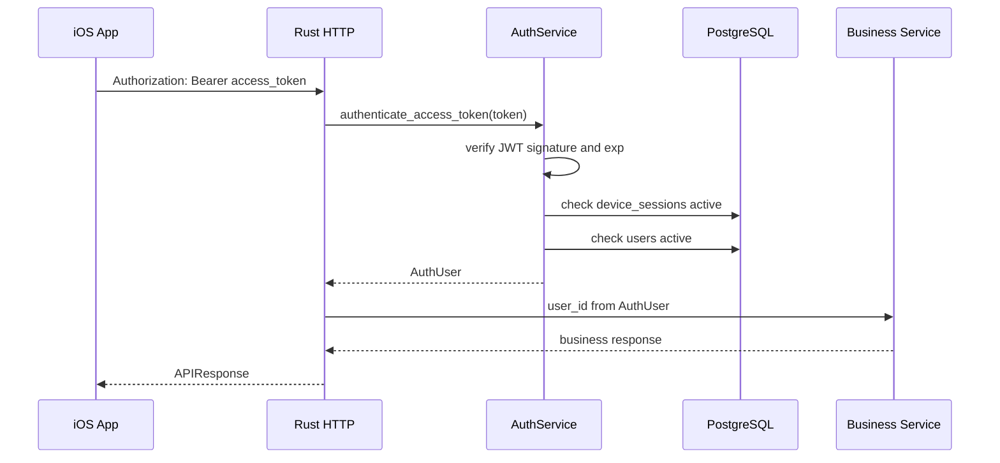

# 认证边界与多设备安全整改设计

- 文档版本：v0.1
- 更新时间：2026-06-17
- 适用范围：Rust 后端认证边界、iOS 登录态处理、宠物/首页/同城/商家业务接口、多设备会话、后续防爬与风控
- 当前推进阶段：P0

## 1. 背景问题

当前项目早期业务接口通过 `x-maohuoban-user-id` 承接用户上下文。这个设计只能表达“客户端声称自己是谁”，不能表达“服务端确认这个用户和设备会话仍然有效”。

这会带来以下问题：

| 问题 | 风险 |
|---|---|
| 客户端可传任意 user id | 业务接口可能被伪造身份调用 |
| 数据库用户缺失时仍进入业务链路 | 可能在媒资上传、宠物创建等后续阶段才失败，留下孤立对象 |
| 无法按设备管理登录态 | A 设备不能可靠踢 B 设备下线 |
| 账号状态没有统一拦截 | 违规、冻结、注销用户仍可能进入业务接口 |
| 商家权限缺少账号承载关系 | 后续商家角色、员工、门店权限无法稳定扩展 |
| 接口容易被爬虫扫 | 只要知道接口和 user id 形态就可能批量探测 |

## 2. 核心原则

| 原则 | 说明 |
|---|---|
| 用户是权限主体 | 个人用户、商家经营者、商家员工都必须先是 `users` 账号 |
| 宠物是业务主体 | 宠物资料围绕宠物建模，但访问权限来自用户或商家主体 |
| 商家是业务组织主体 | 商家资料不能替代账号，用户通过成员关系获得商家权限 |
| 后端生成可信身份 | 业务接口只能使用服务端从 token/session 验证出的 user id |
| 前端只消费认证结果 | 前端遇到认证 401 展示后端 message，清本地登录态并回登录页 |

## 3. 分阶段目标

| 阶段 | 目标 | 验收 |
|---|---|---|
| P0 | 移除业务接口对 `x-maohuoban-user-id` 的信任，统一使用 `Authorization: Bearer <access_token>` | 宠物、媒资、首页、同城、商家入口不再接受裸 user id；401 返回可展示 message；前端自动回登录页 |
| P1 | 完成多设备会话管理和账号状态拦截 | 支持设备列表、单设备踢下线、全端退出、账号冻结/禁用统一 401/403 |
| P2 | 完成商家成员权限和防爬风控 | `merchant_memberships` 权限矩阵落地；登录、上传、创建、查询接口具备限流、审计和异常探测 |

## 4. P0 设计

### 4.1 后端认证流



### 4.2 受保护接口

| 业务域 | 接口范围 | P0 处理 |
|---|---|---|
| 宠物 | `/api/v1/pets/**`、`/api/v1/pet-media/**`、`/api/v1/pet-events/**` | 必须 Bearer token |
| 首页 | `/api/v1/home/dashboard` | 必须 Bearer token |
| 同城 | `/api/v1/same-city/**` | 必须 Bearer token |
| 商家宠物 | `/api/v1/merchants/**` 当前已在 pet router 内 | 必须 Bearer token，P1/P2 再细分商家成员权限 |
| 法务 | 协议、隐私政策 | 公开读取 |
| 认证 | 登录、验证码、refresh、logout | 按认证接口自身契约处理 |
| 媒资内容读取 | `/api/v1/media/**` | 当前公开读，依赖对象 URL 和后续 CDN/RustFS 策略；私密媒资后续单独设计签名 URL |

### 4.3 401 契约

后端认证失效统一返回：

```json
{
  "success": false,
  "code": "auth.session_expired",
  "message": "登录状态已过期，请重新登录",
  "data": null
}
```

| code | 前端行为 |
|---|---|
| `auth.session_expired` | toast 后端 message，清 token，回登录页 |
| `auth.session_revoked` | toast 后端 message，清 token，回登录页 |
| `auth.token_invalid` | toast 后端 message，清 token，回登录页 |
| `auth.account_disabled` | toast 后端 message，清 token，回登录页 |

## 5. P1 预留

| 能力 | 设计方向 |
|---|---|
| 设备列表 | `GET /api/v1/auth/devices` 返回当前用户 active sessions |
| 踢单设备 | `POST /api/v1/auth/devices/{session_id}/revoke` 设置 `revoked_at` |
| 全端退出 | 撤销当前用户所有 active sessions |
| 当前设备识别 | refresh/access token 中保留 `session_id`，客户端展示 device name/platform/last_seen |
| 账号状态 | `users.status` 扩展 `active/disabled/suspended/deleted`，认证层统一拦截 |
| 密码重置 | 重置成功后撤销旧 sessions，按产品策略保留当前恢复设备 |

## 6. P2 预留

| 能力 | 设计方向 |
|---|---|
| 商家成员关系 | 新增 `merchant_memberships(user_id, merchant_id, role, status)` |
| 商家权限矩阵 | owner/admin/operator/viewer 等角色，按接口动作校验 |
| 限流 | 按 IP、user、device、接口维度对登录、上传、创建、查询做 rate limit |
| 防爬 | 对匿名公开接口加频率、User-Agent、IP 段、异常路径探测审计 |
| 审计 | 登录、refresh、踢设备、创建宠物、上传媒资、商家操作写 audit event |
| 媒资访问 | 私密媒资改为签名 URL 或经认证代理读取，公开媒资走 CDN Cache-Control |

## 7. 当前 P0 验收清单

| 项 | 状态 |
|---|---|
| 后端 access token 验证入口 | 已推进 |
| 宠物/媒资接口拒绝裸 user id | 已推进 |
| 首页 dashboard 使用认证 user id | 已推进 |
| 同城接口使用认证 user id | 已推进 |
| 前端业务仓库发送 Bearer token | 已推进 |
| 前端 401 统一回登录页 | 已推进 |
| P1/P2 文档留存 | 已完成 |
