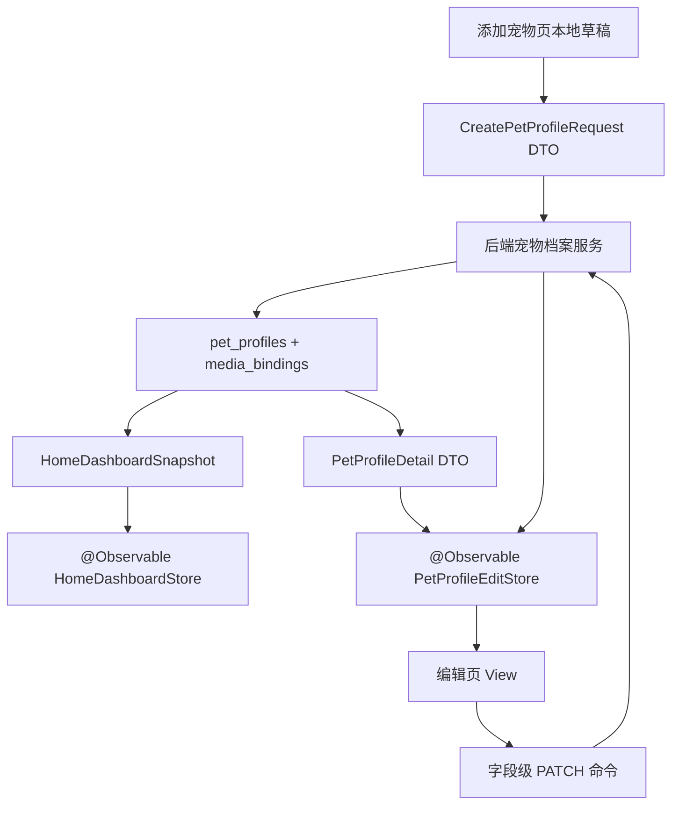

# 宠物档案数据链路重大问题分析

## 1. 结论

当前宠物档案链路存在系统性架构偏差：前端创建 DTO、首页聚合 DTO、编辑页展示模型、媒体模型、Toast 反馈和 Mock 补全边界没有形成同一份契约。宠物档案事实的唯一数据源应为后端 `pet_profiles + media_assets/media_bindings` 聚合后的 DTO；前端只保存临时编辑草稿、加载状态和一次性反馈事件。

这组问题不能继续通过前端兜底、Mock 替换、字段兼容和页面内状态条补丁处理。修复方向应回到单一数据源、前后端契约对齐、MVVM 单向数据流和写入后按后端响应刷新 Store。

## 2. 当前重大问题清单

| 优先级 | 问题 | 归属 | 影响 |
|---|---|---|---|
| P0 | 添加宠物后首页进入网络错误，点击重试恢复 | 待运行时证据确认，入口在前端 Home mutation reload 链路 | 创建成功后的主流程断裂，用户误以为创建失败 |
| P0 | 添加页填写的到家时间、性格标签、备注没有进入创建请求 | 前端 DTO / Mapper | 后端没有收到这些字段，编辑页和首页自然缺失 |
| P0 | 编辑页媒体没有使用后端返回的头像和背景 | 前端编辑模型 / Mapper / URL 解析 | 真实宠物显示 mock 背景和兜底头像 |
| P0 | 首页陪伴天数按创建时间计算 | 后端派生语义 | 产品语义错误，用户看到 0 天 |
| P1 | 编辑页右上角存在“保存”按钮，与分段保存产品语义冲突 | 前端交互模型 | 用户无法理解字段保存边界，MVVM 写入命令不清晰 |
| P1 | 编辑页字段 sheet 只写本地 `@State` 草稿 | 前端 Store / ViewModel | 字段保存没有后端确认，也没有成功 Toast |
| P1 | 添加/编辑页同时有页面内状态条和全局 Toast | 前端反馈边界 | 同一事件重复反馈，后端状态文案直接暴露 |
| P1 | 媒体派生内部文案展示给用户 | 前端 Toast / 状态条映射 | “已生成主题色/派生资源”属于系统内部状态，不应用户可见 |
| P1 | Mock section 补全边界不清晰 | 前端 Repository / Mapper | Mock 可以补 section，但不能覆盖真实宠物核心事实 |
| P1 | 多个核心文件超出 AGENTS.md 文件长度和单职责约束 | 前端/后端模块边界 | 继续叠加功能会扩大耦合，降低契约修复可控性 |

## 3. 单一数据源原则

| 数据类型 | 唯一数据源 | 前端职责 | 后端职责 |
|---|---|---|---|
| 宠物基础信息 | 后端宠物档案 DTO | 渲染、提交编辑命令、根据响应刷新 Store | 持久化、鉴权、字段校验、返回权威 DTO |
| 宠物媒体 | 后端媒体绑定 DTO | 展示后端 URL，上传本地草稿 | 保存 RustFS 对象、绑定宠物、返回 URL、尺寸、派生色 |
| 首页陪伴天数 | 后端首页聚合 DTO | 展示数字 | 基于 `arrival_date` 派生 |
| 主题色 / 内容色 | 后端媒体派生 DTO | 消费颜色字段 | 计算并返回给前端 |
| Mock section | Mock fixture | 只补后端暂缺 section | 无 |
| Toast | 前端反馈事件 | 把写入结果映射为产品文案 | 返回稳定 code/message，避免内部实现文案外露 |

## 4. 证据与根因

### 4.1 添加宠物写入契约漏字段

前端 `PetProfileDraft` 只包含 `name/species/breed/sex/birthday`：

- `maohuoban/maohuoban/Features/Pet/Domain/PetWriteModels.swift:7`
- `maohuoban/maohuoban/Features/Pet/Domain/PetWriteModels.swift:14`

添加页提交也只传这几个字段，且 `breed` 直接传空字符串：

- `maohuoban/maohuoban/Features/Pet/Presentation/Add/PetProfileAddScreen+Actions.swift:279`
- `maohuoban/maohuoban/Features/Pet/Presentation/Add/PetProfileAddScreen+Actions.swift:281`

后端创建请求已经支持完整字段：

- `maohuoban-rust/crates/maohuoban-pet-http/src/pet/dto/requests.rs:20`
- `maohuoban-rust/crates/maohuoban-pet-http/src/pet/dto/requests.rs:26`
- `maohuoban-rust/crates/maohuoban-pet-http/src/pet/dto/requests.rs:47`

结论：到家时间、性格标签、备注在添加页填写后没有进入后端。编辑页显示缺失不是后端读取失败，根因是前端创建 DTO 和提交 Mapper 未对齐后端契约。

### 4.2 编辑页把真实远端媒体降级为 Mock

编辑页媒体模型只支持本地 asset 和本地视频资源，没有 `remoteImage/remoteVideo`：

- `maohuoban/maohuoban/Features/Pet/Domain/PetProfileEditProfile.swift:22`

首页到编辑页的映射把远端背景转换成 fallback asset：

- `maohuoban/maohuoban/Features/Home/Presentation/Sections/HomeDashboardLoadedView.swift:283`
- `maohuoban/maohuoban/Features/Home/Presentation/Sections/HomeDashboardLoadedView.swift:289`

非选中宠物编辑模型直接硬编码 `HomePetHeroMock`：

- `maohuoban/maohuoban/Features/Home/Presentation/Sections/HomeDashboardLoadedView.swift:255`
- `maohuoban/maohuoban/Features/Home/Presentation/Sections/HomeDashboardLoadedView.swift:260`

头像展示直接 `URL(string:)`，相对 URL 无法解析到后端 base URL：

- `maohuoban/maohuoban/Features/Pet/Presentation/Edit/Components/PetProfileEditMediaComponents.swift:39`
- `maohuoban/maohuoban/Features/Pet/Presentation/PetProfileAvatarPreviewScreen.swift:122`

结论：后端已经返回媒体 URL 时，编辑页模型和 Mapper 仍把真实远端媒体丢失，导致显示 mock 背景和兜底头像。这是前端模型边界错误。

### 4.3 陪伴天数后端派生语义错误

后端首页 DTO 已返回 `arrival_date` 和 `companionship_days`：

- `maohuoban-rust/src/home_dashboard.rs:267`
- `maohuoban-rust/src/home_dashboard.rs:273`

当前 `companionship_days` 计算基于 `created_at`：

- `maohuoban-rust/src/home_dashboard.rs:224`
- `maohuoban-rust/src/home_dashboard.rs:227`

结论：陪伴天数属于后端聚合派生字段，应基于 `arrival_date` 计算。前端展示 0 天的根因是后端派生语义不符合产品定义。

### 4.4 编辑页保存语义混乱

右上角同时存在“保存”和“预览”：

- `maohuoban/maohuoban/Features/Pet/Presentation/Edit/PetProfileEditScreen+Presentations.swift:73`
- `maohuoban/maohuoban/Features/Pet/Presentation/Edit/PetProfileEditScreen+Presentations.swift:75`
- `maohuoban/maohuoban/Features/Pet/Presentation/Edit/PetProfileEditScreen+Presentations.swift:84`

字段 sheet 的保存只写本地 `@State` 字典并关闭 sheet，没有调用后端：

- `maohuoban/maohuoban/Features/Pet/Presentation/Edit/PetProfileEditScreen+Presentations.swift:124`
- `maohuoban/maohuoban/Features/Pet/Presentation/Edit/PetProfileEditScreen+Presentations.swift:155`
- `maohuoban/maohuoban/Features/Pet/Presentation/Edit/PetProfileEditScreen+Presentations.swift:197`
- `maohuoban/maohuoban/Features/Pet/Presentation/Edit/PetProfileEditScreen+Presentations.swift:238`
- `maohuoban/maohuoban/Features/Pet/Presentation/Edit/PetProfileEditScreen+Presentations.swift:258`

结论：当前编辑页是“本地草稿 + 顶部保存”的表单语义；产品要求是“每个字段确认即保存”。右上角“保存”应移除，右上角只保留产品确认的单一动作；字段 sheet 保存应进入 Store 命令，等待后端成功后更新页面状态并触发 Toast。

右上角按钮文案当前存在口径冲突：历史消息中出现“预览”，本轮文本出现“完成页”。确定实现前需要产品口径归一，但核心结论已经确定：移除“保存”。

### 4.5 Toast 和页面状态条边界错误

添加页和编辑页都渲染页面内 `PetWriteStatusSection`：

- `maohuoban/maohuoban/Features/Pet/Presentation/Add/PetProfileAddScreen+Body.swift:17`
- `maohuoban/maohuoban/Features/Pet/Presentation/Edit/PetProfileEditScreen+Body.swift:42`

页面内状态条会展示 `derivativeMessage`：

- `maohuoban/maohuoban/Features/Pet/Presentation/PetWriteStatusSection.swift:24`

Toast 映射也会把 `derivativeMessage` 加成 warning：

- `maohuoban/maohuoban/Features/Pet/Presentation/PetWriteToastBridge.swift:42`

结论：添加成功后页面内继续展示后端状态，与全局 Toast 重复。媒体派生、主题色、封面帧属于系统内部处理状态，不应作为用户可见 Toast 或页面状态条。用户只需要看到“档案已保存”“部分媒体保存失败”“保存失败”等产品文案。

### 4.6 Mock 与真实数据并存边界

DEBUG 默认使用 `SupplementedHomeRepository`：真实后端快照优先，Mock 只补后端暂缺 section。

- `maohuoban/maohuoban/Features/Home/Data/HomeRepositoryFactory.swift:10`
- `maohuoban/maohuoban/Features/Home/Data/HomeRepository.swift:58`
- `maohuoban/maohuoban/Features/Home/Domain/HomeDashboardSnapshot.swift:80`

这个方向本身合理，但编辑页媒体 Mapper 把真实远端媒体转换成 mock asset，违反边界。

Mock 的合法边界：

- 可以补 `careSummary/reminders/quickActions/recentTimeline/recommendedContent/petAlbums` 等尚未接入 section。
- 可以在没有真实宠物时提供开发态 fixture。
- 不能覆盖真实宠物的 `id/name/avatar/background/profile_number/arrival_date/personality_tags/note/companionship_days`。
- 不能进入编辑页作为真实宠物的媒体来源。

### 4.7 文件长度与单职责约束未达标

AGENTS.md 约束：

- Swift 文件建议控制在 250 行以内，超过 400 行必须拆分或给出明确理由。
- Rust 文件建议控制在 300 行以内，超过 500 行必须拆分或给出明确理由。
- 一个文件只承担一个主要职责。

当前宠物档案和首页链路中已经存在多处超阈值文件：

| 文件 | 行数 | 违反点 |
|---|---:|---|
| `maohuoban/maohuoban/Features/Home/Presentation/Sections/HomeImmersivePetHeaderSection.swift` | 825 | Swift 超 400 行；同时承载头图布局、媒体渲染、头像、浮层按钮、取色展示 |
| `maohuoban/maohuoban/Features/Pet/Domain/PetWriteModels.swift` | 702 | Swift 超 400 行；创建 DTO、更新 DTO、媒体上传 DTO、媒体资产、派生物、交易导入模型混在一起 |
| `maohuoban/maohuoban/Features/Home/Domain/HomeDashboardSnapshot.swift` | 578 | Swift 超 400 行；首页聚合根模型、宠物摘要、switcher、section、乐观切换逻辑混在一起 |
| `maohuoban/maohuoban/Features/Pet/Stores/PetWriteStore.swift` | 445 | Swift 超 400 行；创建宠物、媒体上传、事件记录、交易导入、更新、删除共用一个 Store |
| `maohuoban/maohuoban/Features/Home/Presentation/Sections/HomeDashboardLoadedView.swift` | 436 | Swift 超 400 行；首页 layout、路由构造、编辑页 Mapper、媒体降级逻辑混在一起 |
| `maohuoban/maohuoban/Features/Home/Data/Mock/HomeMockDashboardFixtures.swift` | 402 | Swift 超 400 行；Mock fixture 与真实契约字段长期纠缠 |
| `maohuoban-rust/src/home_dashboard.rs` | 587 | Rust 超 500 行；路由/查询/聚合/媒体 URL/派生字段/默认 section 混在根 crate |
| `maohuoban-rust/crates/maohuoban-pet-infrastructure/src/postgres/repository/media_commands.rs` | 552 | Rust 超 500 行；上传、RustFS、派生物、绑定、清理任务混在一个文件 |
| `maohuoban-rust/crates/maohuoban-pet-infrastructure/src/postgres/repository.rs` | 517 | Rust 超 500 行；档案查询、创建、更新、删除和媒体关联职责过宽 |

结论：当前实现没有稳定遵循文件长度和单职责约束。尤其是 `PetWriteModels.swift`、`PetWriteStore.swift`、`HomeDashboardSnapshot.swift`、`HomeDashboardLoadedView.swift` 直接参与本次问题链路，它们的职责扩张已经导致 DTO、Mapper、Mock、Toast、媒体模型互相缠绕。

修复这些文件不能做成无目标重构，应跟随契约修复拆分：

| 拆分目标 | 建议边界 |
|---|---|
| `PetWriteModels.swift` | `PetProfileWriteDrafts`、`PetMediaWriteModels`、`PetTradeImportModels`、`PetWritePhase` |
| `PetWriteStore.swift` | `PetProfileWriteStore`、`PetMediaUploadStore`、`PetEventWriteStore` 或按用例拆命令服务 |
| `HomeDashboardSnapshot.swift` | 首页根快照、宠物摘要、section 模型、乐观切换扩展分文件 |
| `HomeDashboardLoadedView.swift` | 纯 View、路由动作、编辑页上下文 Mapper 分离 |
| `home_dashboard.rs` | HTTP handler、读模型查询、宠物摘要 mapper、媒体 URL mapper、默认 section 分模块 |
| `media_commands.rs` | multipart 输入、对象存储写入、派生物生成、绑定替换、GC 任务分模块 |

## 5. 创建成功后首页网络错误的分析边界

静态代码确认写入成功后通过 `onHomeMutationCompleted` 触发首页强制刷新：

- `maohuoban/maohuoban/Features/Home/Presentation/Navigation/HomeRouteDestinationScreen.swift:12`
- `maohuoban/maohuoban/Features/Home/Presentation/HomeRootScreen.swift:62`
- `maohuoban/maohuoban/Features/Home/Stores/HomeDashboardStore.swift:20`

但“网络错误”的真实失败点需要运行时请求/响应证据。当前不能直接断定是后端返回错误、前端重复加载、路由未关闭、selectedPetID 失效，还是媒体上传后读模型短暂不一致。

下一轮定位必须采集：

| 边界 | 需要记录 |
|---|---|
| 添加页保存完成 | `phase`、新宠物 ID、媒体上传结果 |
| mutation 回调 | 是否重复触发、触发时页面是否仍在添加页 |
| 首页请求 | URL、query、user header、selected_pet_id |
| 首页响应 | HTTP status、code、message、data 是否为空 |
| Store 状态 | `requestID`、`loadedContext`、`failedContext` |

## 6. 目标架构

关键约束：

- View 只负责渲染和转发用户事件。
- Store / ViewModel 持有加载状态、提交状态和后端响应。
- 编辑页不把首页摘要当长期事实源；首页摘要只能作为首屏路由上下文或占位。
- 字段级保存以 Store 命令为边界，成功后用后端响应更新 Store。
- Toast 是一次性 UI 反馈事件，不是后端内部状态展示窗口。
- Mock 只补 section，不参与真实宠物核心事实。

## 7. 修复顺序

| 顺序 | 修复项 | 验收标准 |
|---|---|---|
| 1 | 对齐添加宠物 DTO | 创建请求包含到家时间、体重、绝育、性格标签、备注、芯片号 |
| 2 | 后端陪伴天数改为基于 `arrival_date` | 首页返回正确 `companionship_days`，前端只展示 |
| 3 | 编辑页远端媒体模型补齐 | 头像和背景使用后端 URL，背景不再退回 `HomePetHeroMock` |
| 4 | 编辑页建立详情 Store | 字段保存走后端 PATCH，成功后刷新 Store 并 Toast |
| 5 | 移除编辑页右上角“保存” | 只保留产品确认的单一右上角动作 |
| 6 | 清理写入状态展示 | 添加/编辑页移除重复状态条，派生文案不进用户 Toast |
| 7 | 固化 Mock 边界测试 | Mock 不覆盖真实宠物核心字段和媒体 |
| 8 | 定位创建后首页网络错误 | 通过请求/响应日志锁定失败边界并修复 |
| 9 | 按契约修复顺手拆分超长文件 | 每次拆分只围绕当前契约边界，避免无目标大重构 |

## 8. 验证门禁

| 层 | 必须验证 |
|---|---|
| iOS DTO | `PetRepositoryTests` 覆盖创建请求完整字段编码 |
| iOS Store | 字段级保存成功、失败、Toast 事件测试 |
| iOS UI | 添加成功回首页、编辑页头像背景、字段保存 Toast |
| iOS 编译 | `xcodebuild -project maohuoban/maohuoban.xcodeproj -scheme maohuoban -destination 'platform=iOS Simulator,name=iPhone 17 Pro,OS=27.0' -configuration Debug build` |
| Rust 契约 | 首页 `companionship_days` 基于 `arrival_date` 的 contract test |
| Rust 编译 | `cargo fmt --all --check`、`cargo check --workspace --all-targets` |

## 9. 不能继续采用的做法

- 前端用 mock 背景掩盖后端媒体 URL 丢失。
- 前端在多个 View 里散落字段兼容和兜底逻辑。
- 后端把内部派生处理状态作为用户 Toast 文案返回。
- 编辑页同时存在字段保存和页面总保存两套写入语义。
- 首页摘要长期承担编辑详情页事实源。
- Mock 与真实宠物核心字段拼接。
- 在 400+ 行 Swift 文件或 500+ 行 Rust 文件里继续追加新职责。
