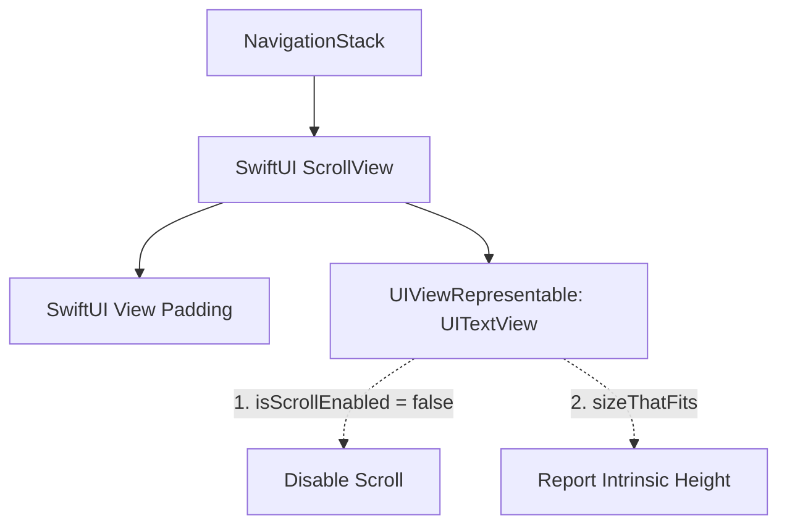

# SwiftUI 与 UIKit 混合视图滚动协调设计指南

在 SwiftUI 中，导航栏（`NavigationBar`）的很多高级特性（如大标题缩放、顶部穿透透明度转换 `.scrollEdgeEffectStyle`、动态隐藏/显示 `.toolbarBackground` 等）都极度依赖底层的滚动协调机制。

本指南旨在总结当页面中需要嵌入 UIKit 滚动组件（如 `UITextView`、`WKWebView`、`UIScrollView` 等）时，如何避免导航栏样式失效以及正文安全区域冲突的最佳实践。

---

## 1. 典型问题与表现（Symptoms）

当使用 `UIViewRepresentable` 封装一个具有滚动能力的 UIKit 组件并将其作为页面主体展示时，通常会遇到以下两种典型 bug：

1. **导航栏背景/分割线残留**：
   - 即使在 SwiftUI 中配置了 `.toolbarBackground(.hidden, for: .navigationBar)` 或使用了透明样式的外观，当用户滚动页面时，导航栏依然显示出默认的半透明高斯模糊背景或有一条灰色的分割细线。
2. **正文与状态栏/导航栏文字重叠**：
   - 尝试通过 `.ignoresSafeArea(edges: .top)` 或将 content inset 设为 `.never` 来强行解决穿透问题，结果导致页面初始状态下，最顶部的文字和标题与系统的状态栏或导航栏返回按钮重合，严重影响视觉体验。

---

## 2. 根本原因分析（Root Cause）

* **滚动偏移量视界隔离**：
  - SwiftUI 的导航控制器（如 `NavigationStack`）通过监控视图层次树中**最近的 SwiftUI 原生滚动容器（如 `ScrollView`、`List`）的滚动位移**来驱动导航栏的外观状态机。
  - 封装在 `UIViewRepresentable` 内部的 UIKit 视图（如 `UITextView` 或 `WKWebView`）虽然内部发生了滚动，但其 `contentOffset` 变化被局限在 UIKit 层面，**SwiftUI 框架对此完全是“瞎的”**。
  - 导航栈检测不到任何滚动事件，便会始终将导航栏维持在**默认的 Scrolled 状态（Standard Appearance）**，从而无法展现顶部的透明过渡。
* **缺乏 Intrinsic Content Size**：
  - UIKit 的 `UIScrollView`（及子类）为了实现高效滚动，默认不提供自然的固有内容大小（`intrinsicContentSize` 为 0）。
  - 若直接将其放入 SwiftUI 布局，要么尺寸缩为 0，要么为了填满屏幕必须强行设定忽略安全区域，进而引发布局重叠。

---

## 3. 最佳实践：自尺寸桥接模式（Self-Sizing Bridge Pattern）

在 iOS 16.0+（以及 iOS 27+ SDK）环境下，最优雅的解法是**剥离 UIKit 视图的滚动职责，将其代理给外层 SwiftUI 容器**。

### 核心设计原则
* **容器归 SwiftUI**：外层使用 SwiftUI 原生 `ScrollView` 接管滚动事件。保证导航控制器能 100% 协调滚动状态。
* **渲染归 UIKit**：禁用 UIKit 视图的内部滚动，使其退化为一个自适应高度的 Leaf View，由外层 ScrollView 统一进行物理排版和手势分发。



### 具体实现步骤

#### 第一步：在 UIKit 视图中禁用滚动与内边距
在 `makeUIView` 中将滚动属性设为 `false`，并把所有的 `contentInset` 设为 `.zero`（内边距转移到 SwiftUI 侧配置，保证布局清晰）。
```swift
func makeUIView(context: Context) -> UITextView {
    let textView = UITextView()
    textView.isScrollEnabled = false // 核心：禁用内部滚动
    textView.backgroundColor = .clear
    textView.textContainer.lineFragmentPadding = 0
    return textView
}
```

#### 第二步：实现 `sizeThatFits` 提供高度回馈 (iOS 16+)
重写 `UIViewRepresentable` 的 `sizeThatFits` 方法。根据父视图提出的尺寸建议（`proposal.width`），获取 UIKit 视图在特定宽度下渲染全部内容所需的真实高度。
```swift
func sizeThatFits(_ proposal: ProposedViewSize, uiView: UITextView, context: Context) -> CGSize? {
    // 获取 SwiftUI 推荐的宽度限制（兜底为合理宽度）
    let width = proposal.width ?? 320
    
    // 询问 UIKit 视图在当前宽度限制下排版完全部文字所需要的尺寸
    let size = uiView.sizeThatFits(CGSize(width: width, height: .greatestFiniteMagnitude))
    return size
}
```

#### 第三步：使用 SwiftUI 原生 `ScrollView` 包裹
在页面主体结构中，直接包裹该桥接视图，并使用原生的 SwiftUI 修饰符进行边距、背景和导航栏控制。
```swift
ScrollView {
    MyHTMLTextView(html: document.html)
        .padding(.horizontal, 20)
        .padding(.top, 16)
}
.background(Color.background.ignoresSafeArea())
.toolbarBackground(.hidden, for: .navigationBar) // 强制透明
```

---

## 4. 真实案例研究（Case Study）

在 `maohuoban-code` 项目中，用户协议与隐私条款页面就成功应用了该设计模式：
* 案例视图：[LegalDocumentView.swift](file:///Users/fengjinyi/Desktop/maohuoban-code/maohuoban/maohuoban/Features/Legal/Presentation/LegalDocumentView.swift)
* 渲染组件：[LegalHTMLTextView.swift](file:///Users/fengjinyi/Desktop/maohuoban-code/maohuoban/maohuoban/Features/Legal/Presentation/LegalHTMLTextView.swift)

此重构移除了所有全局污染导航栈的 UIKit 外观拦截代码，且实现了状态栏的天然适配与完美的透明渐变滚动。

---

## 5. 官方参考链接（References）

1. **UIViewRepresentable sizeThatFits**：
   [developer.apple.com - UIViewRepresentable/sizeThatFits(_:uiView:context:)](https://developer.apple.com/documentation/swiftui/uiviewrepresentable/sizethatfits(_:uiview:context:)) (iOS 16.0+)
2. **ProposedViewSize 机制**：
   [developer.apple.com - ProposedViewSize](https://developer.apple.com/documentation/swiftui/proposedviewsize)
